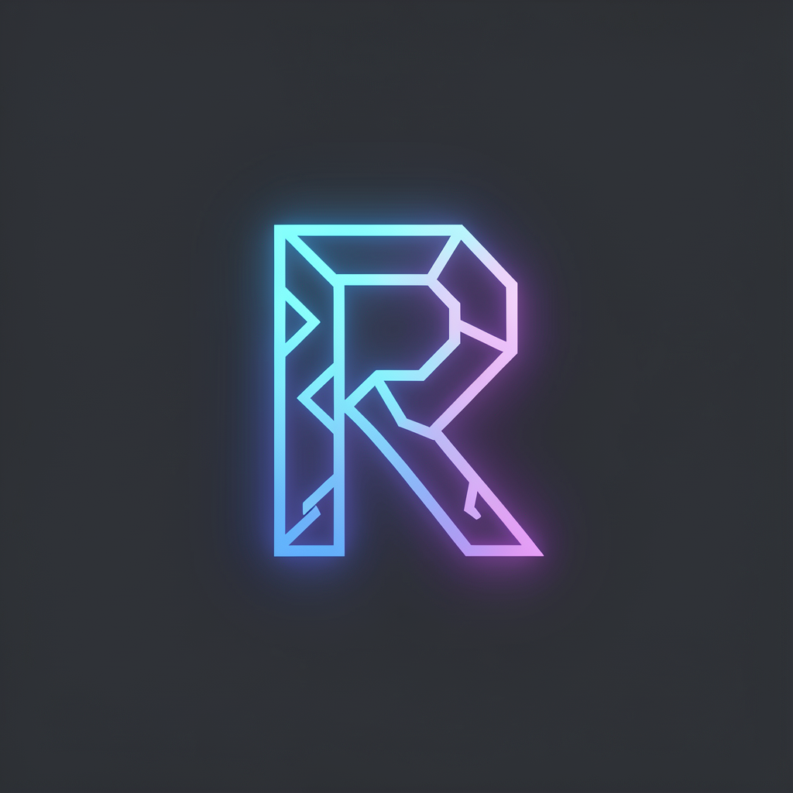

<p align="center">
  
</p>

<h1 align="center">Rune</h1>
<p align="center"><em>Modern Roblox Development Toolkit — A Rojo alternative</em></p>

<p align="center">
  
  
  
  
</p>

---

**Rune** bridges your filesystem and Roblox Studio with real-time bidirectional sync. Code in VS Code, see changes instantly in Studio.

| ✨ Filesystem → Studio | ✨ Studio → Filesystem | ✨ Hot Reload |
|:---:|:---:|:---:|
| Save a file | Changes sync back | Instant updates |

---

## 🚀 Quick Start

```bash
git clone https://github.com/BarisTheDeveloper/rune.git
cd rune
pnpm install
npx tsc
node install-plugin.mjs        # Installs plugin to Roblox Studio
rune watch                     # Start syncing!
```

Then in Roblox Studio: **Plugins → ◆ RUNE → Connect**

---

## 📦 Installation

### CLI

```bash
# Requirements: Node.js 18+, pnpm 11+
git clone https://github.com/BarisTheDeveloper/rune.git
cd rune
pnpm install
npx tsc

# Optional: link globally
pnpm link --global .
```

### Studio Plugin

**Option 1: Auto-install**
```bash
node install-plugin.mjs
```
This builds `RunePlugin.rbxmx` and copies it to your Roblox Plugins folder.

**Option 2: Download from Releases**
1. Go to [Releases](https://github.com/BarisTheDeveloper/rune/releases)
2. Download `RunePlugin.rbxmx`
3. Move to `%LOCALAPPDATA%\Roblox\Plugins\`

**Option 3: CLI install**
```bash
rune install -g rune-plugin
```

---

## 🎮 The Plugin

<p align="center">
  
</p>

**◆ RUNE** — a minimal VS Code-inspired Studio plugin with:

- 🔍 **Searchable file tree** with expand/collapse
- 📋 **Activity log** with copyable entries
- 🔔 **Toast notifications** for sync events
- ↩️ **Undo** last 20 changes
- 🌐 **Dual transport**: WebSocket + HTTP polling fallback
- ⏯️ **Play mode safe**: auto-pauses during playtesting

---

## 📁 Project Structure

```
rune init --name MyGame
```

Creates a complete Roblox project skeleton:

```
src/
├── Workspace/            ├── ReplicatedStorage/
├── ServerScriptService/  ├── ServerStorage/
├── StarterPlayer/        ├── StarterGui/
│   ├── StarterCharacterScripts/
│   └── StarterPlayerScripts/
├── Lighting/             ├── SoundService/
├── Players/              ├── Teams/
├── Chat/                 └── ...15 services total
└── rune.json
```

---

## 🔧 Commands

| Command | Description |
|---------|-------------|
| `rune init` | Create new project |
| `rune watch` | Watch files + sync server |
| `rune sync` | Sync server only |
| `rune build` | Build `.rbxlx` place file |
| `rune install` | Install packages/plugins |

---

## 📡 Protocol

| Direction | Message | Purpose |
|-----------|---------|---------|
| CLI → Studio | `full_sync` | Complete hierarchy |
| CLI → Studio | `instance_created` | File added |
| CLI → Studio | `instance_updated` | File changed |
| CLI → Studio | `instance_deleted` | File removed |
| Studio → CLI | `studio_instance_created` | Studio instance |
| Studio → CLI | `studio_script_updated` | Script source changed |

---

## 🛠 Tech

| Layer | Stack |
|-------|-------|
| CLI | TypeScript, Node.js, Commander |
| Transport | WebSocket (`ws`), HTTP polling |
| File watch | Chokidar |
| Build | Custom RBXMX builder (no Rojo) |
| Plugin | Luau, Roblox Studio API |

---

## 🗺 Roadmap

- [ ] Roblox-TS / TypeScript → Luau compilation
- [ ] `rune build --upload` to Roblox Cloud
- [ ] Team collaboration sync
- [ ] Plugin marketplace
- [ ] Asset pipeline

---

<p align="center">
  <sub>Inspired by <a href="https://rojo.space/">Rojo</a> · Built for the Roblox community</sub>
</p>
